# Website Construction and Deployment

## Overview

This document will introduce how to use Hugo to build a personal website and deploy it to the Github page so that other people can access your website.

## Installation

The installation steps in this document will take the Windows 10 operating system as an example, please install it according to the practical environment of your computer.

### Installing Git

1. Open [Git](#https://git-scm.com/download) website.
2. Select the installation package suitable for the local system to download.
3. Double-click the Git installer and follow the instructions to complete the Git installation.

### Installing Hugo 

**Step 1: Download the Hugo installation package**
   1. Open [Hugo](#https://gohugo.io/) website.
   2. Select the installation package suitable for the local system to download.

**Step 2: Create a bin directory**

   1. Create a **Hugo > bin** directory folder on the local disk.
   2. Store the Hugo decompressing files in the bin folder.

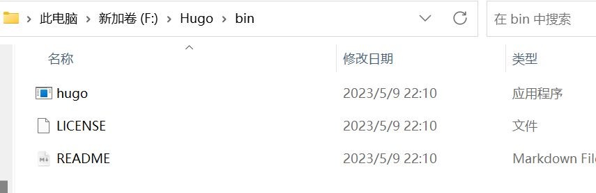

**Step 3: Configure PATH Environment Variables**

1. Right-click **This PC** in Windows and select **Properties > Advanced System Settings**.
2. On the "Advanced" tab, click **Environment Variables**.

   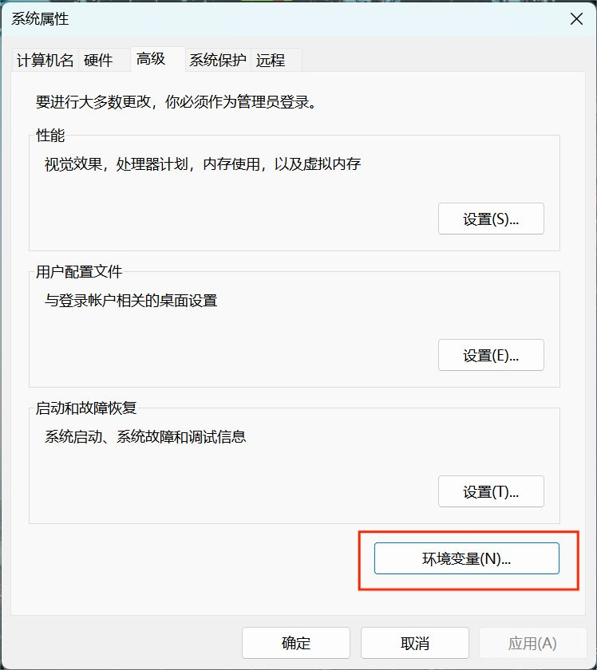

3. In the pop-up window, select the Path item in the System variables box and click **Edit**.
4. The "Edit Environment Variables" window will pops up, and modify the Path entry to the bin directory address as shown in the following figure. Click **OK** to complete the modification.
   
   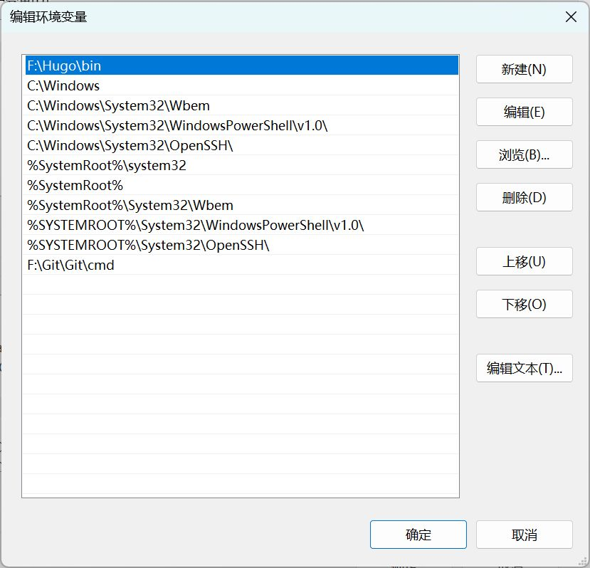

**Step 4: Verify Installation**

Run **cmd** and execute the **hugo version** command  to verify whether Hugo is installed successfully. 

  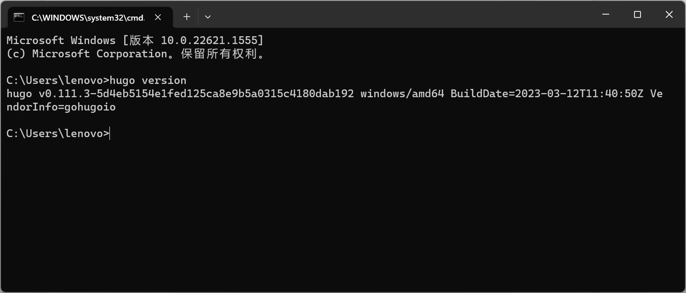

## Prerequisites

### Signning up for a Github Account

New users have to create a Github account before use it.

1. Open [Github](#https://www.github.com) website.
2. Click **Sign up** in the upper-right corner of the page to register an account.
3. In the pop-up window, enter **username**, **email address**, **password**, etc.
4. Click **Create an account**.

### Configuring Git Key 

Git is based on a variety of transport protocols, the most commonly used of which are https and ssh. Setting the SSH key is designed to transfer local resources to GitHub without password, skipping the steps to enter the account password every time, and also ensuring the security of the transmission.

**Step 1: Generate a key**

1. Run **cmd** and execute the **ssh-keygen -t rsa -C 'email'** command .

   > Note: email is the email address bound when registering GitHub.

     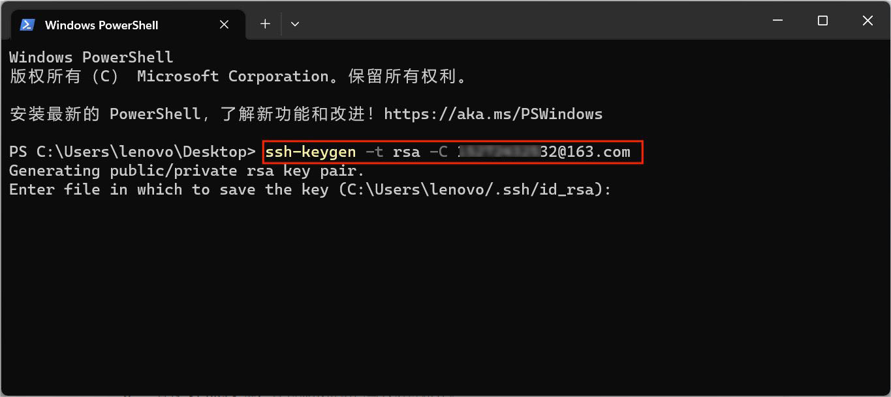

2. Press the **Enter** key three times in a row until you are prompted that the key has been written to the corresponding path.

   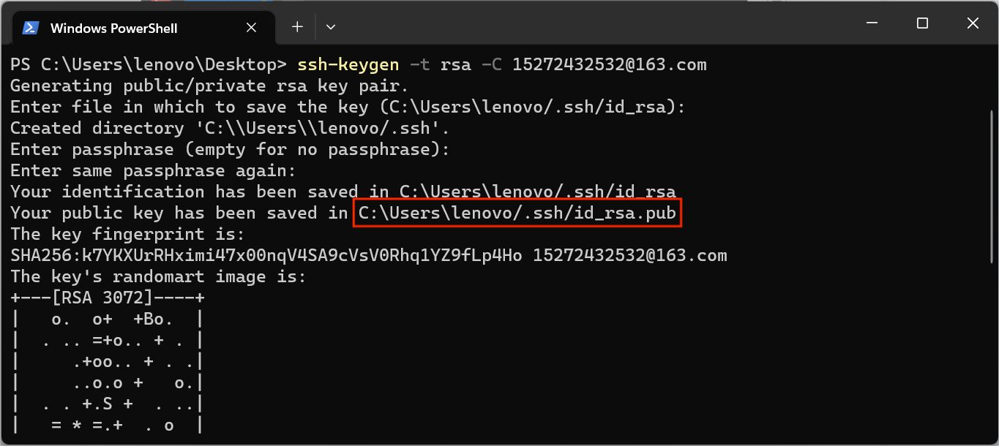

3. Locate the “id_rsa.pub file” in the ssh folder, view and copy the key.

   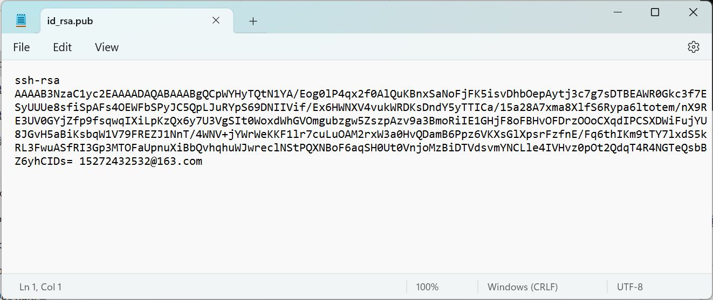

**Step 2: Add a key**

1. Go to the GitHub homepage, click user account picture in the upper right corner, and select **Settings** from the drop-down options.
2. Select **SSH and GPG keys** in the left navigation bar.

   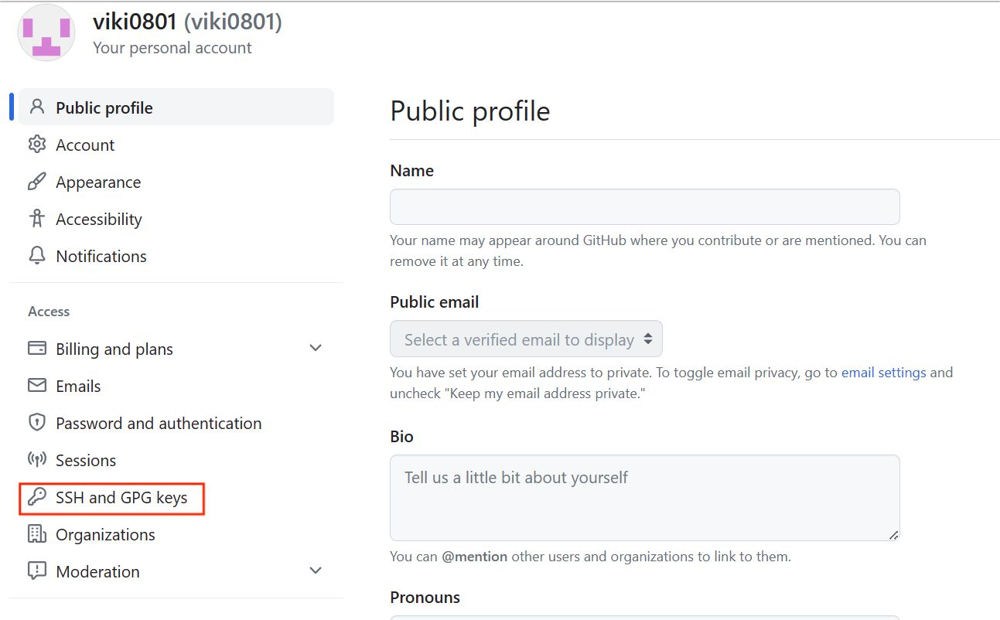

3. Copy the key from the local "id_rsa.pub file" in the Github Key text box and click **Add SSH key**.

   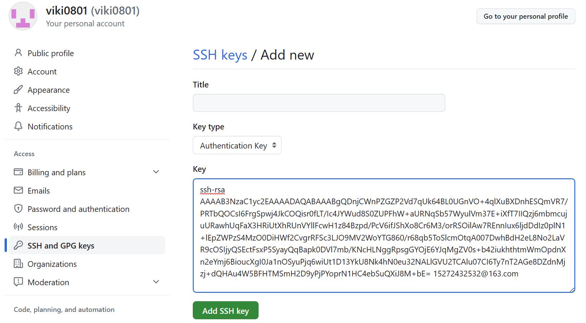

4. After adding the key, the password input box pops up on the page. Enter the Github password to complete the password confirmation.

## Creating a Website

### Creating a New Site

Run **cmd** in any directory, execute the **hugo new site <*sitename*>** command  to create a new site, while a folder named after the site will be generated under the directory folder.

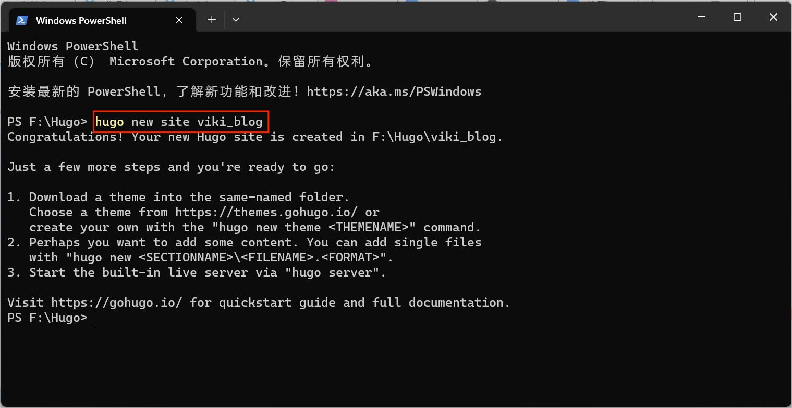

### Creating a New Document

Run **cmd** in the new site directory and execute the **hugo new post/<*filename.md*>**  command to create a new document which will be displayed on the personal site.

### Installing a Theme

Hugo official website provides a large number of open source themes, and each theme repository provides specific installation methods. This section will take "hugo_theme_adam_eve" theme as an example.

1. Select a theme (for example, hugo_theme_adam_eve) and click **Download** on the theme interface.
2. Enter the theme project repository interface and view the theme installation steps.

   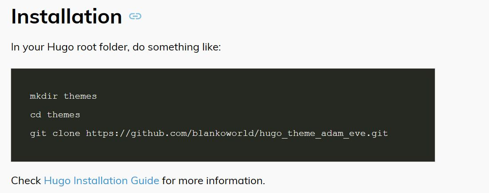

3. According to the theme installation steps, run **cmd** in the theme directory and execute the **git clone <*theme_address*>** command. 
   
### Running the Website

1. Execute the **hugo server --theme=<*themename*> --buildDrafts** command to run the website.
2. Type localhost:1313 in your browser to view the sample site, and the new document and theme style will also be displayed.

   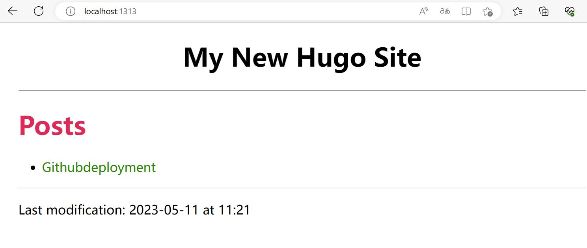

## Deploying the Website

### Creating a Repository

1. In the Github profile, click **Create Repository**.
2. A "Create a new repository" interface pops up, you can do the following settings.
   - **Repository name**: the repository name must be the same as the registered username. For example, if the username is xxx, the repository name must be xxx.github.io.
   - **Description(optional)**: describe your repository.
   - Access Permission: select **Public** so that other users can access your website.
   - Initialize this repository with: check **add a README file** to automatically create a main branch.

   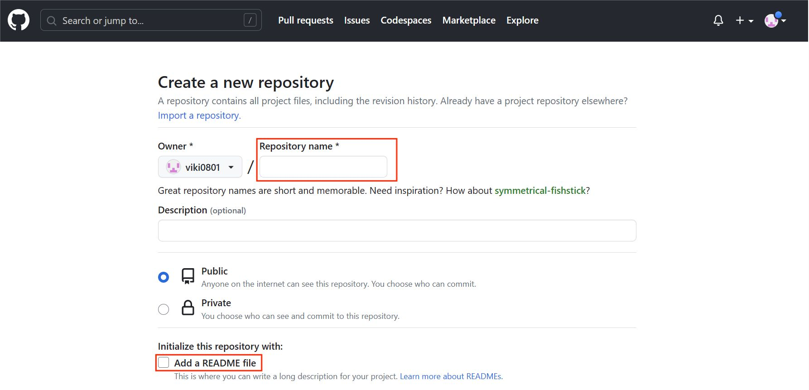

3. Click **Create repository**.

### Deploying the Website to Github Page

After running the hugo command, a public folder is automatically generated in the personal site folder, which is the target folder and needs to be pushed to Github. The specific steps are as below.

1. Execute the **git init** command  in the public folder to initialize.
2. Run the **git remote add origin <*repository_address*>** to associate the local public folder with the git repository.
3. Execute the **git add .** command to add the public files.
4. Execute the **git commit -m "content"** command to submit the information.
5. Run the  **git push origin master** command to push the files to the repository.

   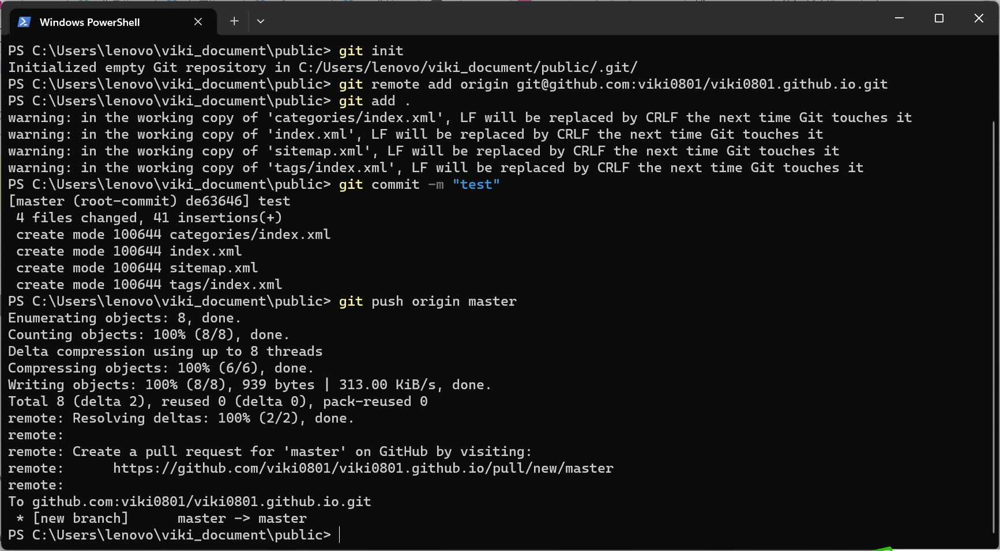
